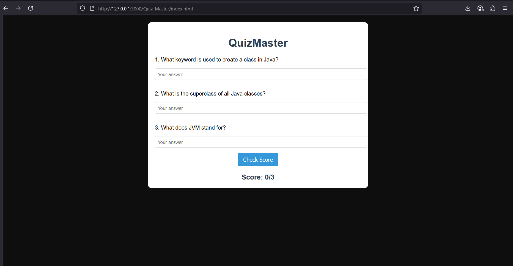

# Quiz_Master
## Date:12-07-2025
## Objective:
To demonstrate the concepts of callback functions and higher-order functions in JavaScript by building a simple quiz scoring system where the evaluation logic is passed as a callback to a higher-order function.

## Tasks:

#### 1. Create the HTML Layout:
Add a heading ```<h1>QuizMaster</h1>```

Add a few mock questions (or inputs for answers — optional)

Add a “Check Score” button

Display the final score in a ```<div> or <p>```

#### 2. Add CSS Styling:
Style the layout with a clean font and spacing

Add background color and rounded buttons

Keep the output score in a prominent style

#### 3. JavaScript Functionality:
Create a higher-order function called calculateScore(callback)

The callback will contain the logic for checking answers (or mocked results)

Pass different callback functions to demonstrate modular scoring (e.g., strict or lenient scoring)
## HTML Code:
```html
<!DOCTYPE html>
<html lang="en">
<head>
    <meta charset="UTF-8">
    <meta name="viewport" content="width=device-width, initial-scale=1.0">
    <title>QuizMaster</title>
    <link rel="stylesheet" href="styles.css">
</head>
<body>
    <div class="container">
        <h1>QuizMaster</h1>
        <div class="quiz">
            <p>1. What keyword is used to create a class in Java?</p>
            <input type="text" id="q1" placeholder="Your answer">
            
            <p>2. What is the superclass of all Java classes?</p>
            <input type="text" id="q2" placeholder="Your answer">
            
            <p>3. What does JVM stand for?</p>
            <input type="text" id="q3" placeholder="Your answer">
            
            <button id="checkBtn">Check Score</button>
            <div id="scoreDisplay">Score: 0/3</div>
        </div>
    <script src="scripts.js"></script>
</body>
</html>
```
## CSS Code:
```css
body {
    font-family: Arial, sans-serif;
    background-color: #0e0e0f;
    margin: 0;
    padding: 20px;
}

.container {
    max-width: 600px;
    margin: 0 auto;
    background-color: white;
    padding: 20px;
    border-radius: 10px;
    box-shadow: 0 0 10px rgba(0,0,0,0.1);
}

h1 {
    color: #2c3e50;
    text-align: center;
}

.quiz {
    margin-top: 20px;
}

input {
    width: 100%;
    padding: 8px;
    margin-bottom: 15px;
    border: 1px solid #ddd;
    border-radius: 4px;
}

button {
    background-color: #3498db;
    color: white;
    border: none;
    padding: 10px 15px;
    border-radius: 4px;
    cursor: pointer;
    font-size: 16px;
    display: block;
    margin: 0 auto;
}

button:hover {
    background-color: #2980b9;
}

#scoreDisplay {
    text-align: center;
    font-size: 20px;
    font-weight: bold;
    margin-top: 20px;
    color: #2c3e50;
}
```
## JavaScript Code:
```js
function calculateScore(checkAnswersCallback) {
    const answers = {
        q1: document.getElementById('q1').value,
        q2: document.getElementById('q2').value,
        q3: document.getElementById('q3').value
    };
    
    const score = checkAnswersCallback(answers);
    document.getElementById('scoreDisplay').textContent = `Score: ${score}/3`;
}


function strictScoring(answers) {
    let score = 0;
    if (answers.q1.toLowerCase() === 'class') score++;
    if (answers.q2.toLowerCase() === 'object') score++;
    if (answers.q3.toLowerCase() === 'java virtual machine') score++;
    return score;
}


function lenientScoring(answers) {
    let score = 0;
    if (answers.q1.toLowerCase().includes('class')) score++;
    if (answers.q2.toLowerCase().includes('object')) score++;
    if (answers.q3.toLowerCase().includes('java virtual machine')) score++;
    return score;
}


document.getElementById('checkBtn').addEventListener('click', function() {
    calculateScore(strictScoring);
});
```
## Output:


## Result:
A mini module using JavaScript callbacks and higher-order functions is successfully created. This reinforces real-world use of passing functions as arguments to other functions and modularizes logic for reusability.
